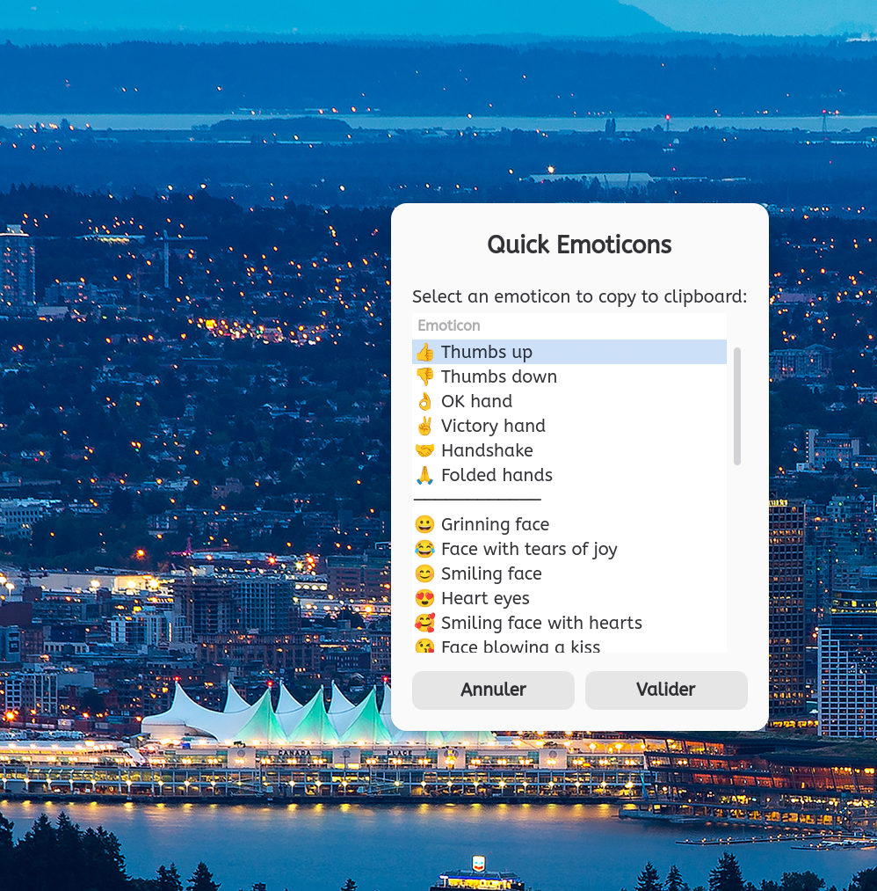

# Copy an Emoticon

Quick access to commonly used emoticons with clipboard copy, directly from the Nemo context menu.



## Requirements

- `zenity` — selection dialog
- `xclip` — clipboard management
- `gnome-characters` — full character map access

```bash
sudo apt install zenity xclip gnome-characters
```

## Installation

### One-line install

```bash
curl -L "https://github.com/pzim-claude/nemo-actions/releases/latest/download/copy-emoticon@pzim-devdata.zip" -o /tmp/copy-emoticon.zip && unzip -o /tmp/copy-emoticon.zip -d ~/.local/share/nemo/actions && rm /tmp/copy-emoticon.zip && nemo -q
```

### Manual install

Download [copy-emoticon@pzim-devdata.zip](https://github.com/pzim-claude/nemo-actions/releases/latest/download/copy-emoticon@pzim-devdata.zip), then:

```bash
unzip copy-emoticon@pzim-devdata.zip -d ~/.local/share/nemo/actions
nemo -q
```

## Usage

Right-click anywhere in Nemo (or on the desktop) and select **"Copy an Emoticon"**. A dialog appears with emoticons grouped by category — click one to copy it to your clipboard.

- 👍 👎 👌 ✌️ 🤝 🙏 — hand gestures
- 😀 😂 😊 😍 🥰 😘 😉 🤔 😎 😢 😭 😡 🤗 🤩 😴 — faces
- ❤️ ⭐ ✨ 🎉 🎊 🔥 💯 — symbols
- **"More icons..."** — opens the full character map (gnome-characters)

A desktop notification confirms each copy.

## Translations

21 languages: ar, ca, cs, da, de, en_CA, es, fi, fr, fr_CA, hu, it, ja, nl, pl, pt, ru, tr, uk, vi, zh_CN

## Author

[pzim-claude](https://github.com/pzim-claude)
