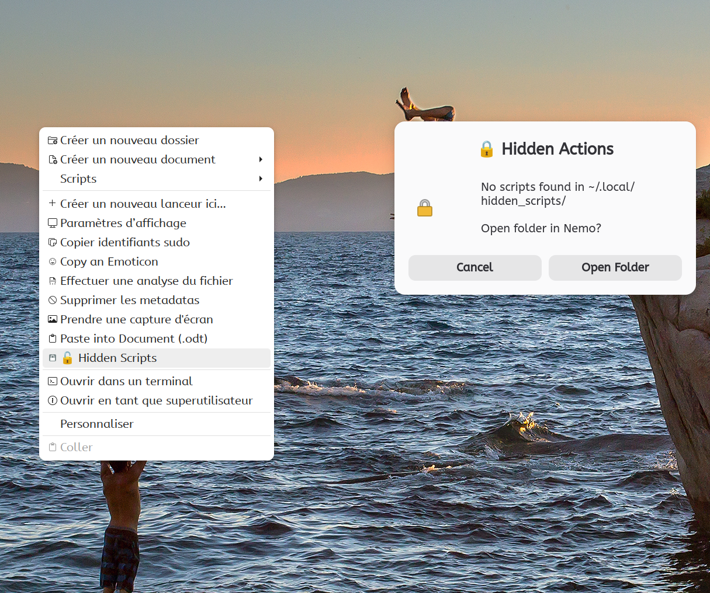

# Hidden Actions

Execute custom scripts via Ctrl+Right-click in Nemo, keeping your context menu clean while having quick access to powerful scripts.



## Requirements

- `python3-xlib` — X11 keyboard state detection
- `zenity` — dialog interface

```bash
sudo apt install python3-xlib zenity
```

## Installation

### One-line install

```bash
curl -L "https://github.com/pzim-claude/nemo-actions/releases/latest/download/hidden-actions@pzim-devdata.zip" -o /tmp/hidden-actions.zip && \
unzip -o /tmp/hidden-actions.zip -d /tmp/hidden-actions-install && \
mv /tmp/hidden-actions-install/hidden-actions@pzim-devdata/* ~/.local/share/nemo/actions/ && \
rm -rf /tmp/hidden-actions.zip /tmp/hidden-actions-install && \
nemo -q
```

### Manual install

Download [hidden-actions@pzim-devdata.zip](https://github.com/pzim-claude/nemo-actions/releases/latest/download/hidden-actions@pzim-devdata.zip), extract and move contents:

```bash
unzip hidden-actions@pzim-devdata.zip -d /tmp/hidden-actions-install && \
mv /tmp/hidden-actions-install/hidden-actions@pzim-devdata/* ~/.local/share/nemo/actions/ && \
rm -rf /tmp/hidden-actions-install && \
nemo -q
```

## Usage

Hold **Ctrl + Right-click** anywhere in Nemo → select **"🔒 Hidden Actions"** → choose a script to execute.

### Adding your own scripts

```bash
mkdir -p ~/.local/share/hidden_scripts/
cat > ~/.local/share/hidden_scripts/hello.sh << 'EOF'
#!/bin/bash
notify-send "Hello" "This is a hidden action!"
EOF
chmod +x ~/.local/share/hidden_scripts/hello.sh
```

## How it works

A Python script detects whether the Ctrl key is pressed via X11. If yes, Nemo shows the action. Scripts are loaded from `~/.local/share/hidden_scripts/` and presented in a zenity dialog.

## Translations

21 languages: ar, ca, cs, da, de, en_CA, es, fi, fr, fr_CA, hu, it, ja, nl, pl, pt, ru, tr, uk, vi, zh_CN

## Author

[pzim-claude](https://github.com/pzim-claude)
