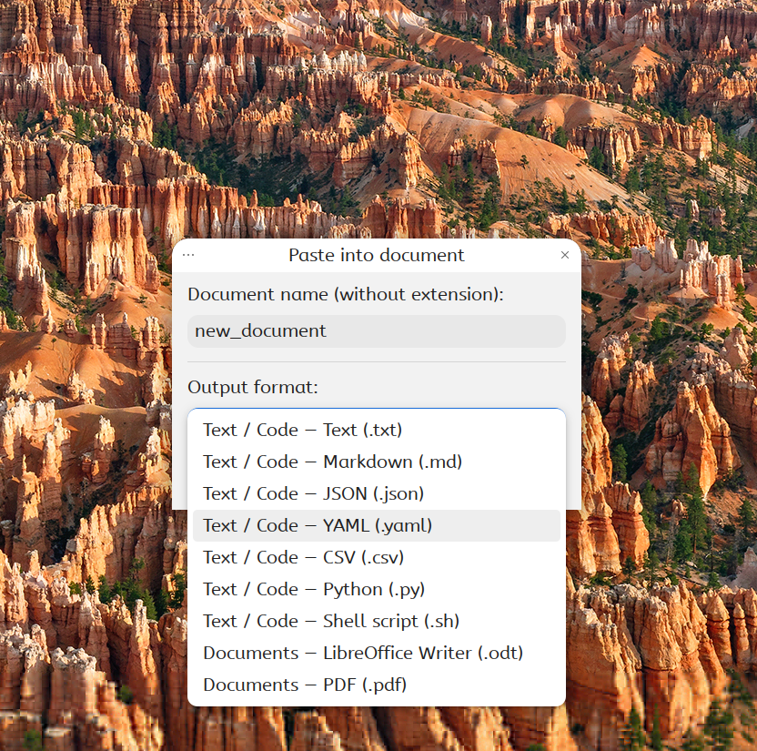

# Paste into Document (.odt)

Paste clipboard content into a new document directly from Nemo's context menu. Supports rich text, images, and multiple output formats.



## Requirements

- `python3` (pre-installed on most systems)
- `libreoffice` — for document and PDF output

```bash
sudo apt install libreoffice
```

## Installation

### One-line install

```bash
curl -L "https://github.com/pzim-claude/nemo-actions/releases/latest/download/paste-into-document@pzim-devdata.zip" -o /tmp/paste-into-document.zip && unzip -o /tmp/paste-into-document.zip -d ~/.local/share/nemo/actions && rm /tmp/paste-into-document.zip && nemo -q
```

### Manual install

Download [paste-into-document@pzim-devdata.zip](https://github.com/pzim-claude/nemo-actions/releases/latest/download/paste-into-document@pzim-devdata.zip), then:

```bash
unzip paste-into-document@pzim-devdata.zip -d ~/.local/share/nemo/actions
nemo -q
```

## Usage

1. Copy any content to clipboard (text, formatted text, image, or file)
2. Right-click in any Nemo folder → select **"Paste into Document (.odt)"**
3. Enter a filename (auto-suggested from content)
4. Choose the output format
5. The document is created at the current location

## Supported output formats

txt, md, html, json, yaml, csv, py, sh, odt, pdf

## Author

[pzim-claude](https://github.com/pzim-claude)
