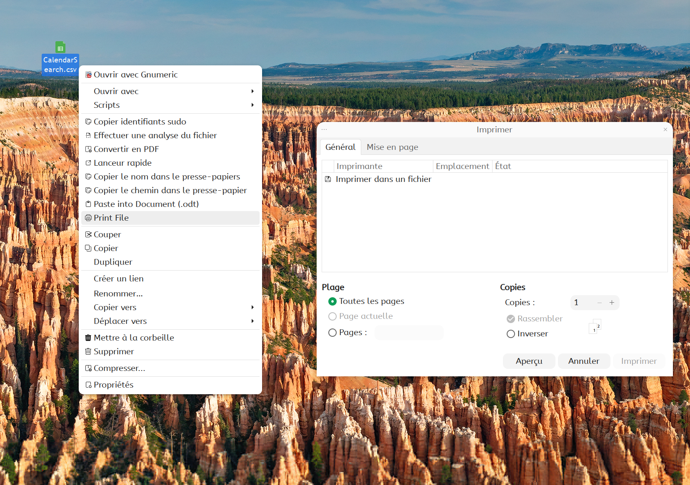

# Print File

Open the native GTK print dialog for any file directly from Nemo's context menu — identical to File > Print in gedit, evince, or any GNOME application.



## Requirements

- `python3-gi` (pre-installed on most Debian-based systems)

```bash
sudo apt install python3-gi
```

## Installation

### One-line install

```bash
curl -L "https://github.com/pzim-claude/nemo-actions/releases/latest/download/print-native@pzim-devdata.zip" -o /tmp/print-native.zip && \
unzip -o /tmp/print-native.zip -d /tmp/print-native-install && \
cp -rf /tmp/print-native-install/print-native@pzim-devdata/. ~/.local/share/nemo/actions/print-native@pzim-devdata/ && \
rm -rf /tmp/print-native.zip /tmp/print-native-install && \
nemo -q
```

### Manual install

Download [print-native@pzim-devdata.zip](https://github.com/pzim-claude/nemo-actions/releases/latest/download/print-native@pzim-devdata.zip), extract and copy contents:

```bash
unzip print-native@pzim-devdata.zip -d /tmp/print-native-install && \
cp -rf /tmp/print-native-install/print-native@pzim-devdata/. ~/.local/share/nemo/actions/print-native@pzim-devdata/ && \
rm -rf /tmp/print-native-install && \
nemo -q
```

## Usage

Right-click on any file → select **"Print File"**. The native GTK print dialog opens with full CUPS options: printer selection, duplex, orientation, quality, color, number of copies, and more.

## Supported file types

Text files, PDF, PostScript, images (JPEG, PNG, GIF, BMP, TIFF, SVG), office documents, HTML, Markdown, and more.

## Author

[pzim-claude](https://github.com/pzim-claude)
