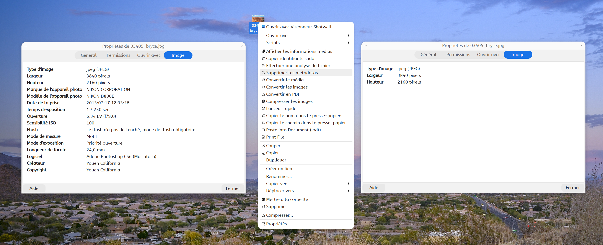

# Remove Image Metadata

Remove all EXIF, IPTC, XMP and other metadata from image files directly from Nemo's context menu.



## Requirements

- `exiftool` — metadata read/write tool

```bash
sudo apt install exiftool
```

## Installation

### One-line install

```bash
curl -L "https://github.com/pzim-claude/nemo-actions/releases/latest/download/remove-image-metadata@pzim-devdata.zip" -o /tmp/remove-image-metadata.zip && \
unzip -o /tmp/remove-image-metadata.zip -d /tmp/remove-image-metadata-install && \
mv /tmp/remove-image-metadata-install/remove-image-metadata@pzim-devdata/* ~/.local/share/nemo/actions/ && \
rm -rf /tmp/remove-image-metadata.zip /tmp/remove-image-metadata-install && \
nemo -q
```

### Manual install

Download [remove-image-metadata@pzim-devdata.zip](https://github.com/pzim-claude/nemo-actions/releases/latest/download/remove-image-metadata@pzim-devdata.zip), extract and move contents:

```bash
unzip remove-image-metadata@pzim-devdata.zip -d /tmp/remove-image-metadata-install && \
mv /tmp/remove-image-metadata-install/remove-image-metadata@pzim-devdata/* ~/.local/share/nemo/actions/ && \
rm -rf /tmp/remove-image-metadata-install && \
nemo -q
```

## Usage

Select one or more image files → Right-click → **"Remove image metadata"**. All metadata is permanently removed from the original files.

> ⚠️ **Warning**: This action overwrites the original files. Make sure you have backups if you need to preserve metadata.

## Supported formats

**Common:** JPEG, PNG, GIF, BMP, TIFF, WEBP

**RAW:** CR2, CR3, NEF, ARW, RAF, ORF, RW2, PEF, DNG, and 30+ more

**Other:** HEIC, HEIF, PSD, and more — 50+ formats total

## Metadata removed

EXIF, IPTC, XMP, GPS, MakerNotes, ICC Profile, JFIF, Photoshop IRB, and more.

## Author

[pzim-claude](https://github.com/pzim-claude)
